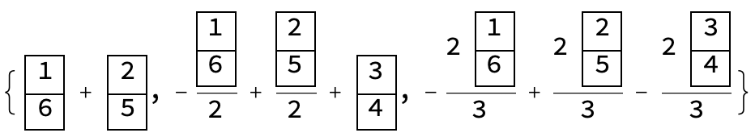
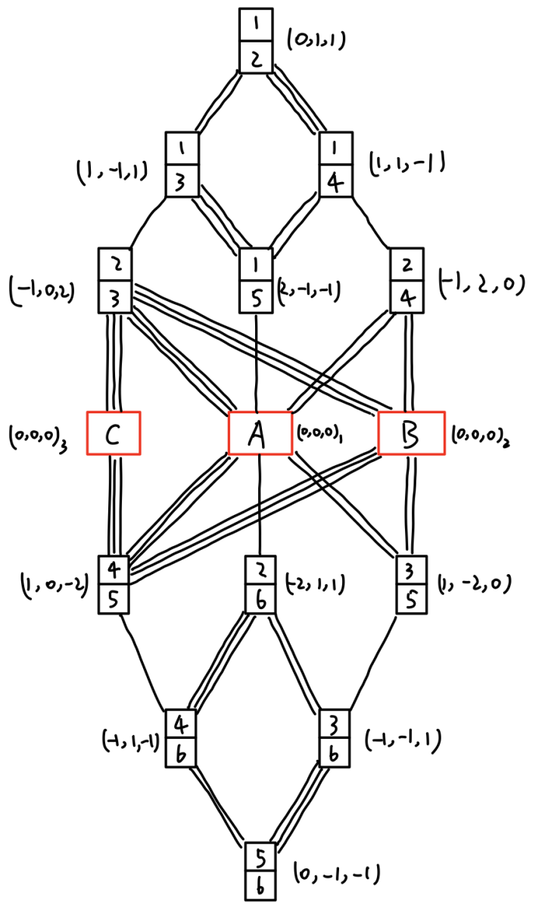

A **simple Lie algebra** is a Lie algebra that is non-abelian and contains no nonzero proper ideals. A finite-dimensional simple complex Lie algebra is isomorphic to either one of the following **classical Lie algebras**: 

- $A_{n-1}$: generators of $\mathrm{SU}(n)$ group,
- $B_n$: generators of $\mathrm{SO}(2n+1)$ group,
- $C_n$: generators of $\mathrm{SO}(2n)$ group,
- $D_n$: Generators of $\mathrm{USp}(2n)$ group,

or one of the five exceptional Lie algebras: $\mathrm{G}_2$, $\mathrm{F}_4$, $\mathrm{E}_6$, $\mathrm{E}_7$, and $\mathrm{E}_8$. This notes discusses the linear irreducible representations of the classical Lie algebras. I have summarized some tedious calculations into this `Mathematica` package, which will be used to perform calculations for several concrete representations of Lie groups. There are generally two parallel methods for Lie algebra representations:

1. Analyzing the **root system** of the algebra and obtaining the **weight states** by subtracting simple roots from the highest weight state, with different weight states and their connections forming a weight diagram. This method can quickly obtain representations for smaller problems, but the meaning of each weight state is unclear, especially when there are degenerate weights. 
2. Using the **tensor representation** of Lie groups and obtaining irreducible representations through **Young tableaux**. This method requires more operations, but each state has a clear "physical meaning," and the analysis of the degenerate weights is clearer.

This note mainly discusses the latter method and emphasizes the "physical meaning" of tensor representations and tensor Young tableaux. The tensor representation is the representation of the group on the multi-particle Hilbert space, and a Young tableau is isomorphic to a multi-particle wave function. The definition of tensor representation is: for a given tensor $T_{a_1,a_2,\cdots,a_N}$, it transforms "like a tensor" under group action:

$$
(O_uT)_{a_1,\cdots,a_n} = \sum_{b_1,\cdots, b_N} u_{a_1,b_1}\cdots u_{a_N,b_N} T_{b_1,\cdots,b_N},
$$


where each $u_{a_i,b_i}$ is a basic representation of the group. An equivalent statement is that group action can be decomposed into a direct product of basic representations:
$$
O_u(g) = u_1(g)\otimes u_2(g) \otimes \cdots \otimes u_N(g),
$$
which is the form of onsite symmetry in many-body systems. For onsite symmetry acting on $N$ lattice sites, the wave functions naturally form a $d^N$ representation of the group, which is generally reducible. We can obtain the irreducible representations in the tensor space using the Young diagram method. Similarly, the basis for irreducible representations obtained by the Young diagram method corresponds to a set of wave function bases in Hilbert space.

So how do we obtain wave functions? In tensor representation, the states of the irreducible representation space are given by the Young diagrams. Each tensor Young diagram is obtained by the action of a canonical Young operator on a tensor basis, resulting in another symmetrized tensor, which is the many-body wave function. For example, the tensor Young diagram


can be regarded as the canonical Young operator


acting on the tensor basis $\Psi_{1,1,2}$, resulting in the following symmetrized tensor $2 \Psi_{1,1,2} - \Psi_{1,2,1} - \Psi_{2,1,1}$. This is a symmetrized tensor and also a 3-particle wave function. At the same time, this tensor Young diagram can also be represented by another canonical Young operator


acting on another tensor basis $\Psi_{1,2,1}$, resulting in the following tensor $-\Psi_{1, 1, 2} + 2 \Psi_{1, 2, 1} - \Psi_{2, 1, 1}$. These two wave functions are not identical, nor orthogonal. However, it can be proved that tensors (wave functions) corresponding to different canonical Young operators are linearly independent. Hereafter, we assume that the Young diagram corresponds to the wave function generated by the smallest Young operator (filling the Young diagram in order).

## Representation of $\mathrm{su}(N)$

Now let's get into specific examples. We will mainly discuss the SU(3) group, which has no essential difference compared to higher SU(N) groups. Here we briefly introduce the usage of the `Mathematica` package. Place the file `ClassicalLieAlgebra.wl` in a folder, create a new notebook file with extension `.nb` in the same folder, and input the import command on the first line:

```mathematica
Import[NotebookDirectory[]<>"ClassicalLieAlgebra.wl"];
```

The first function of this package is to give us the specific information of the algebra generators. For example, the command to obtain the standard generators of SU(3) is:

```mathematica
MatrixForm/@Generators[SU[3]]
```

The result is 8 Gell-Mann matrices:


We can also obtain the **Cartan-Weyl basis** of this algebra using the following command:

```mathematica
{h, e, f} = CartanWeyl[SU[3]];
Print["H = ", MatrixForm /@ h, ", E = ", MatrixForm/@e, ", F = ", MatrixForm /@ f];
```


For building representations, the most useful generator is the **Chevalley basis**, whose specific form is:

```mathematica
{h, e, f} = Chevalley[SU[3]];
Print["H = ", MatrixForm /@ h, ", E = ", MatrixForm /@ e, ", F = ", MatrixForm /@ f];
```


We see that under the Chevalley basis, the generators form two coupled SU(2) groups, whose relationship can be visually expressed as a 3-level system transition:


We see that the three types of Chevalley basis generators have the following effects on this 3-level system:

- $E_1, E_2$ are operators that raise the energy levels, while $F_1, F_2$ are operators that lower the energy levels.
- $E_1, F_1, H_1$ form the SU(2) algebra between $\left| 1 \right \rangle$ and $\left| 2 \right \rangle$, while $E_2, F_2, H_2$ form the SU(2) algebra between $\left| 2 \right \rangle$ and $\left| 3 \right \rangle$.
- $H_1, H_2$ correspond to the two "magnetic quantum numbers" of this 3-level system, and each energy level has an eigenvalue determined by $H_1, H_2$.
- From the eigenvalues of $H_1, H_2$, we can see that $E_1$ increases the magnetic quantum numbers by $(2,-1)$, while $E_2$ increases the magnetic quantum numbers by $(-1,2)$. Correspondingly, the operators $F_1, F_2$ decrease the corresponding magnetic quantum numbers.

This 3-level system provides the fundamental representation of SU(3). To obtain larger representations, we only need to consider the representations given by $N$ such 3-level systems under the action of generators. For an N-body system, the total generators are:
$$
H = \sum_i H_i ,\quad  E = \sum_i E_i ,\quad  F = \sum_i F_i.
$$
The total magnetic quantum numbers can be used to label different states in the representation. This is also known as the weight of the state, and states with different weight values must be orthogonal. But sometimes certain weight values in space are expressed as several linearly independent states. These states may not be orthogonal, and this is when we encounter the issue of degenerate weights. At this point, orthogonalization is required. The procedure for orthogonalization is similar to that in quantum mechanics.

### Young Tableau and Wave Function

To obtain an irreducible representation space, we actually only need to start from any wave function in this space and continuously act on the group generators to generate a closed space, which is the irreducible representation space. Therefore, the most important thing for the SU(3) irreducible representation is to find a state for each irreducible representation space.

The Young tableaux provide such a state, which is the highest-weight state of the irreducible representation. The SU(3) group irreducible representation can be represented by a Young tableau $[\lambda_1, \lambda_2]$ with no more than two rows, and the corresponding representation is denoted as $(\lambda_1-\lambda_2,\lambda_3)$. The index of the representation represents the weight value of the highest weight state or the "magnetic quantum number" of the highest weight state (determined by the eigenvalue of the Chevalley basis generator $H_i$). The tensor Young tableau of the highest weight state of each representation is to fill all the 1 in the first row of the Young diagram and all the 2 in the second row. For example, for the $(1,1)$ representation, its tensor Young tableau is:


The corresponding wave function of this tensor Young tableau can be implemented with the following command:

```mathematica
ct = Tableau[{{1, 2}, {3}}];
v = Psi[1, 1, 2];
TableauPermute[ct, v]
```

The output result is

```mathematica
2 Psi[1,1,2] - Psi[1,2,1] - Psi[2,1,1]
```

That is to say, for the $(l_1,l_2)$ representation of SU(3), the tensor Young tableau with the shape $[l_1+l_2,l_2]$ filled according to the above rules is the highest weight state of this representation.

Next, as long as we continuously act on the highest weight state with the generators until we cannot obtain more linearly independent wave functions, we can obtain the representation space. From here on, we can actually complete the next calculation entirely on the wave function. However, we still keep the form of the tensor Young tableau because it provides a "compact" form for the many-body wave function. At the same time, the tensor Young tableau intuitively displays some permutation symmetries of the wave function. For example, since the elements of the Young operator are all anti-symmetric, the same number cannot appear in the same column of the tensor Young tableau, otherwise the wave function is 0.

### The (1, 1) representation of su(3)

Now, we start from the highest weight state and act on two generators under the Chevalley basis on this wave function. The new wave function obtained by the action represents a "transition" process under the action of the generators, and we can use lines to represent a "transition" process (a single line represents the action of $F_1$, and a double line represents the action of $F_2$). We temporarily do not discuss the size of the transition matrix elements here. The results of the first-level "transition" are:


We labeled the weight of each state next to each Young tableau (the weight calculation can be obtained by adding up the magnetic quantum numbers of each small cell or by using the lowering operator to obtain the weight change of the weight).

Now let's consider level 2 and pay attention to the state on the left:


Under the action of $F_1$, it is annihilated (the same number appears in the same column), and under the action of $F_2$, it becomes a superposition state of two tensor Young diagrams:


On the right-hand side, the state is annihilated under the action of $F_2$ (no digit 2 appears in the tensor Young diagram), and the state obtained under the action of $F_1$ is:


The second table is not a regular Young tableau, but can be symmetric using the symmetry of the Young operator (1 exchanges with 2,3).


Converted to regular tensor Young diagram, finally:


At this point, the weights of the two wave functions obtained by level 3 are $(0,0)$, which indicates a situation of heavy weight. At this time, we need to orthogonalize the weight space. Just like the orthogonalization in quantum mechanics, the choice of the basis is not unique. The customary selection is to retain the state generated by the generator with smaller index, and orthogonalize the other states relative to this state. Here, it corresponds to retaining the state on the right. Now, we can orthogonalize these two Young diagrams into wave functions. This mechanical procedure can be completed using the Mathematica package. First, establish two tensor Young diagrams:

```mathematica
a = 2 TensorTableau[{{1, 2}, {3}}] - TensorTableau[{{1, 3}, {2}}];
b = TensorTableau[{{1, 3}, {2}}] + TensorTableau[{{1, 2}, {3}}];
```

The orthogonalization function is:

```mathematica
{c, d} = TableauOrthogonalization[a, b];
```

Finally, we can print the results:

```mathematica
TableauForm /@ {c, d}
```


In this way, we have drawn the structure diagram of the (1,1) representation of the SU(3) Lie algebra, and we see that this is an 8-dimensional space, and 8 nodes give a set of orthonormal bases for this space. At the same time, the transition behavior between the generating elements in this space basis state may also be determined by this structural diagram.

Now, there is one more question, which is the size of the transition matrix element between the generating elements among these nodes. This is actually similar to a quantum mechanics problem. The coefficient of the transition is largely determined by the normalization of each state. Here we analyze a specific transition process, which is the one in the above figure:


We start from the state:


and denote it as $\left| a \right\rangle$, first normalize it by the following command:

```mathematica
a = TensorTableau[{{1, 2}, {2}}];
na = TableauNormalization[a];
Print["|a> = ", TableauForm[na]];
```


The result of the action of the generating element $F_2$ is:


We denote this state as $\left| b \right\rangle$, and the two basis states $\left| c \right \rangle,\left| d \right \rangle$​. First, we normalize the states $\left| c \right \rangle$ and $\left| d \right \rangle$ and calculate their inner product separately. This calculation can be performed using the following command (which also displays the normalized states):

```mathematica
b = TensorTableau[{{1, 2}, {3}}]/Sqrt[6] + TensorTableau[{{1, 3}, {2}}]/Sqrt[6];
c = TensorTableau[{{1, 3}, {2}}];
d = 2 TensorTableau[{{1, 2}, {3}}] - TensorTableau[{{1, 3}, {2}}];
nc = TableauNormalization[c];
nd = TableauNormalization[d];
Print["|c> = ", TableauForm[nc], ", |d> = ", TableauForm[nd], ", |d> = ", TableauForm[nd],", <d|b> = ", TableauDot[nd, b]];
```

The corresponding wave function inner product is the transition matrix element.

### su(4) and higher rank algebras

Now we consider higher-rank algebras. First, we observe the generators of higher-rank SU(N) in the Chevalley basis:

```mathematica
{h, e, f} = Chevalley[SU[4]];
Print["H = ", MatrixForm /@ h, ", E = ", MatrixForm /@ e, ", F = ", MatrixForm /@ f];
```


```mathematica
{h, e, f} = Chevalley[SU[5]];
Print["H = ", MatrixForm /@ h];
Print["E = ", MatrixForm /@ e];
Print["F = ", MatrixForm /@ f];
```


By now, we can see the pattern: from SU(3) to SU(4), we only increase one level, add the corresponding raising and lowering operators, and add a "magnetic quantum number" operator, and so on.


For the SU(4) algebra, we take the simplest example: $(0,1,0)$, which represents the highest weight:


Since there is no repeated weight in the construction process, we can directly draw the entire diagram:


This concludes our discussion of the SU(N) algebra. The method for constructing representation spaces is basically the same, with only the specific form of the generators changing.


## Representation of other classical algebras

### The $\mathrm{so}(2N+1)$ algebra

Now let's analyze the second type of typical Lie algebra, SO(2N+1). Similarly, we first look at the generators of SO(5):

```mathematica
MatrixForm /@ Generators[SO[5]]
```


We know that the standard generators of SO(N) correspond to "rotations" determined by two axes. However, this set of generators is not convenient for Lie algebra representation. We obtain the Chevalley basis by the following command:

```mathematica
{h, e, f} = Chevalley[SO[5]];
Print["H = ", MatrixForm /@ h];
Print["E = ", MatrixForm /@ e];
Print["F = ", MatrixForm /@ f];
```

and get the desired generators in the "level transition" form. Note that the representation basis of the Chevalley basis has been transformed from the coordinate basis to the spherical harmonic basis, and the five states of the spherical harmonic basis are:

```mathematica
MatrixForm/@StandardBasis[SO[5]]
```


Thus, the basic representation of SO(5) can be represented by a five-level system:


Compared with SU(N), the behavior of the generators here is more complex. For example, $E_1$ and $E_2$ no longer act on only one level, but can raise $|2\rangle$ or $|5\rangle$, and the coefficients of $E_1$ and $E_2$ are no longer the same. At the same time, the "magnetic quantum number" operator $H_1$ and $H_2$ are not as regular as in SU(N), but the method is basically the same.

To facilitate the observation of the regularity, let's take a step further and look at the form of the generators of SO(7):

```mathematica
{h, e, f} = Chevalley[SO[7]];
Print["H = ", MatrixForm /@ h];
Print["E = ", MatrixForm /@ e];
Print["F = ", MatrixForm /@ f];
```


We see that the operators $E_1$, $E_2$, and $E_3$ have different statuses, and the effect of the generators on this seven-level system is:


Following this pattern, in the following we generate the (2,0,0) representation of so(7).

The highest weight states for SO(2N+1) follow the same pattern as for SU(N), but we consider tensor Young diagrams with no more than N rows (the maximum number of rows in a Young diagram is determined by the rank of the Lie algebra, i.e., the number of "magnetic quantum number" operators $H_i$). For a Young diagram of shape $[\lambda_1 ,\cdots, \lambda_N]$, the corresponding representation index is $(\lambda_1 - \lambda_2, \lambda_2-\lambda_3, \cdots,\lambda_{N-1}-\lambda_N, 2 \lambda_3)$, with a factor of 2 on the last component. The highest weight tensor Young diagram is filled by placing the number i in the i-th row. We now consider the (2,0,0) representation of SO(7), whose highest weight state is shown below:


Starting from this state and applying the generating elements according to the rules, we can draw the next 6 levels without encountering any repeated weight:


However, at the 7th level, we encounter a repeated weight, indicated by the red box. We then apply the Gram-Schmidt orthogonalization procedure:

```mathematica
a = TensorTableau[{{2, 6}}] + TensorTableau[{{1, 7}}];
b = TensorTableau[{{3, 5}}] + TensorTableau[{{2, 6}}];
c = TensorTableau[{{4, 4}}] + TensorTableau[{{3, 5}}];
{a, b} = TableauOrthogonalization[a, b];
{a, c} = TableauOrthogonalization[a, c];
{b, c} = TableauOrthogonalization[b, c];
TableauForm /@ {a, b, c}
```

The resulting orthogonal states are denoted by A, B, and C, and the remaining levels can be completed without encountering any repeated weight:


This completes the discussion of SO(2N+1) algebraic representations. For the special orthogonal group SO(N), the discussion requires distinguishing between even and odd N, which we will consider next.

### The $\mathrm{so}(2N)$ algebra

Now let's consider the third type of typical Lie algebra, SO(2N). We first look at the Chevalley basis generators of SO(4):

```mathematica
{h, e, f} = Chevalley[SO[4]];
Print["H = ", MatrixForm /@ h, ", E = ", MatrixForm /@ e, ", F = ", MatrixForm /@ f];
```


Note that the Chevalley basis matrices are also written in terms of spherical harmonics, and the corresponding basis vectors are:

```mathematica
MatrixForm /@ StandardBasis[SO[4]]
```


These generators correspond to a 4-level system:


To observe the pattern further, we ask the program to print out more generators of the SO(6) group:

```mathematica
{h, e, f} = Chevalley[SO[6]];
Print["H = ", MatrixForm /@ h];
Print["E = ", MatrixForm /@ e];
Print["F = ", MatrixForm /@ f];
```


Corresponding to a 6-level system:


The highest weight of SO(2N) is also represented by a Young diagram with no more than N rows. When the number of rows in the Young diagram is less than $N$, the filling of the highest weight tensor Young diagram is the same as that of SU(N), that is, the i-th row is filled with the number $i$, and the corresponding irreducible representation indices are
$$
(\lambda_1 -\lambda_2, \cdots,\lambda_{N-2}-\lambda_{N-1},\lambda_{N-1}, \lambda_{N-1}).
$$
However, when the number of rows in the Young diagram is equal to N, the N-th row can be filled with either N or N+1: when filled with N, the corresponding representation index is
$$
(\lambda_1 - \lambda_2, \cdots, \lambda_{N-1} - \lambda_N,\lambda_{N-1} + \lambda_N );
$$
when filled with N+1, the corresponding representation index is
$$
(\lambda_{1} - \lambda_2, \cdots, \lambda_{N-1} + \lambda_N,\lambda_{N-1} - \lambda_N).
$$
We can also see this directly from the "magnetic quantum number" of the highest weight state. Let's take the example of the $(0,1,1)$ representation of SO(6), whose highest weight state is:


We push the diagram to the fourth level:


The heavy weight condition appears in the red box, so we perform orthogonalization:

```mathematica
a = TensorTableau[{{2}, {5}}] + TensorTableau[{{1}, {6}}];
b = TensorTableau[{{2}, {5}}] + TensorTableau[{{3}, {4}}];
c = TensorTableau[{{2}, {5}}] - TensorTableau[{{3}, {4}}];
{a, b} = TableauOrthogonalization[a, b];
{a, c} = TableauOrthogonalization[a, c];
{b, c} = TableauOrthogonalization[b, c];
TableauForm /@ {a, b, c}
```



denoted as A, B, C. We then complete the other half of the diagram:



### The $\mathrm{sp}(2N)$ algebra

Now we consider the last typical Lie algebra, USp(2N), which is the Lie algebra of unitary symplectic group. We first ask the program to print out the Chevalley basis generators for USp(4):

```mathematica
{h, e, f} = Chevalley[Sp[4]];
Print["H = ", MatrixForm /@ h, ", E = ", MatrixForm /@ e, ", F = ", MatrixForm /@ f];
```


Corresponding to a 4-level system:


Next, we look at the generators of USp(6):

```mathematica
{h, e, f} = Chevalley[Sp[6]];
Print["H = ", MatrixForm /@ h];
Print["E = ", MatrixForm /@ e];
Print["F = ", MatrixForm /@ f];
```


Corresponding to a 6-level system:


For the highest weight state rule of irreducible representations of USp(2N), similar to SU(N) and SO(2N+1), the Young diagram should not have more than N rows. We take the example of the (0,1,0) representation of USp(6). Its highest weight state is:


Similarly, we easily reach the 4th level:


Note that the minus sign for the superimposed state symbol in the red box comes from the negative sign that appears in the "transition rule". Also, the red box has a degenerate weight, which requires an orthogonalization procedure:

```mathematica
a = TensorTableau[{{2}, {5}}] - TensorTableau[{{1}, {6}}];
b = TensorTableau[{{3}, {4}}] - TensorTableau[{{2}, {5}}];
{a, b} = TableauOrthogonalization[a, b];
TableauForm /@ {a, b}
```


The orthogonalized states are denoted as A and B, and we can continue to complete the remaining half diagram:


### Summary

Through specific calculations of the representation space for the 4 typical Lie algebras, we can have an intuitive understanding of the construction of irreducible representation spaces for typical Lie algebras. The construction of representations for different Lie algebras is completed in 4 steps:

- The tensor Young diagram is mapped to a wave function, and the highest weight state of some irreducible representation is obtained using the corresponding filling rule for the Young diagram.
- The lowering operator is applied to the tensor Young diagram to "transition" to new states, while recording their "magnetic quantum numbers", and states with different "magnetic quantum numbers" are orthogonal.
- Sometimes, the "transitioned" tensor Young diagrams are not regular, so they are converted to regular tensor Young diagrams (linear combinations of them) using the symmetry of the tensor Young diagram.
- When multiple states have the same "magnetic quantum number", the corresponding degenerate space needs to be orthogonalized.

The main difference between different Lie algebras lies in the "transition rule" of the generators. However, this part does not need to be memorized. We can directly determine the "transition rule" by printing out the generators in the Chevalley basis using a program.
