# A guided tour of SU(3)

> Part of [**ClassicalLieAlgebra**](../README.md). This is the long-form walkthrough: the classical-algebra background, a worked construction of the SU(3) representations with figures, and the high-level representation engine. For installation and a quick overview, see the [README](../README.md).

## Background

A Lie algebra is *simple* if it is non-abelian and contains no nonzero proper ideal. Every finite-dimensional simple complex Lie algebra falls into one of four infinite families ($A_n$, $B_n$, $C_n$, $D_n$), or is one of the five exceptional algebras $G_2$, $F_4$, $E_6$, $E_7$, $E_8$. The four families are the complexified Lie algebras of the classical matrix groups:

| Family | Algebra | Group |
| :--- | :--- | :--- |
| $A_{n-1}$ | $\mathfrak{su}(n)$ | $\mathrm{SU}(n)$ |
| $B_n$ | $\mathfrak{so}(2n+1)$ | $\mathrm{SO}(2n+1)$ |
| $C_n$ | $\mathfrak{sp}(2n)$ | $\mathrm{USp}(2n)$ |
| $D_n$ | $\mathfrak{so}(2n)$ | $\mathrm{SO}(2n)$ |

This package builds the generators and the irreducible representations of these algebras. It provides three entry points: `SU[n]`, `SO[n]` (which covers both the $B$ and $D$ families), and `Sp[n]`, together with the Young-tableau tools used to label and orthogonalize representation states.

## Usage

The package is a Wolfram paclet. From a local checkout:

```mathematica
PacletDirectoryLoad["/path/to/LieAlgebra"];
Needs["ClassicalLieAlgebra`"];
```

or install a released build:

```mathematica
PacletInstall["https://github.com/jayren3996/LieAlgebra/releases/download/v1.0.0/ClassicalLieAlgebra-1.0.0.paclet"];
Needs["ClassicalLieAlgebra`"];
```

> **API note (v1.0).** This release is a restructured paclet with a redesigned API. Algebras canonicalize to `LieAlgebra["A"|"B"|"C"|"D", rank]`, with `SU[n]`/`SO[n]`/`Sp[n]` as shorthands. `CartanWeyl[g]` and `Chevalley[g]` now return an association (`"Cartan"`, `"Raising"`, `"Lowering"`) instead of an `{H, E, F}` list; both are shorthands for `Generators[g, "CartanWeyl"|"Chevalley"]`. New root-system helpers: `Rank`, `LieAlgebraDimension`, `CartanMatrix`, `SimpleRoots`, `PositiveRoots`, `FundamentalWeights`. The old per-element accessors and `StandardChevalley` are gone, and `StandardBasis` is now `BasisTransform`. The sp(2n) standard generators (previously not closed under the bracket) were corrected. (For runnable, up-to-date examples, see [`demos/`](../demos/).)

## Example: su(3)

We walk through SU(3). Higher SU(N) groups work in exactly the same way.

### Generators

`Generators` returns the standard generators of the algebra. For SU(3) these are the eight Gell-Mann matrices:

```mathematica
MatrixForm /@ Generators[SU[3]]
```

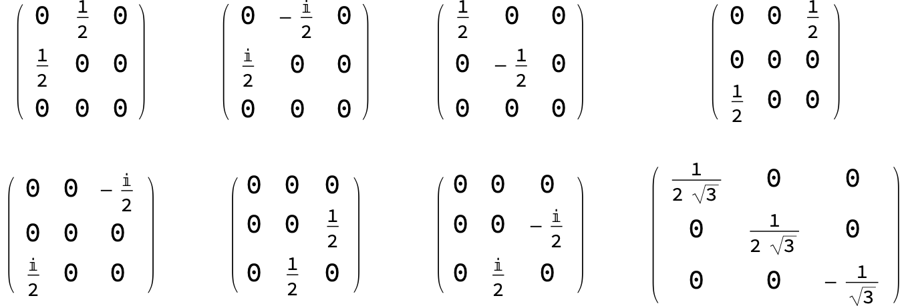

### Cartan–Weyl basis

`CartanWeyl[g]` returns an association with the diagonal Cartan generators (`"Cartan"`), the raising operators (`"Raising"`), and the lowering operators (`"Lowering"`).

```mathematica
cw = CartanWeyl[SU[3]];
Print["H = ", MatrixForm /@ cw["Cartan"], ", E = ", MatrixForm /@ cw["Raising"], ", F = ", MatrixForm /@ cw["Lowering"]];
```

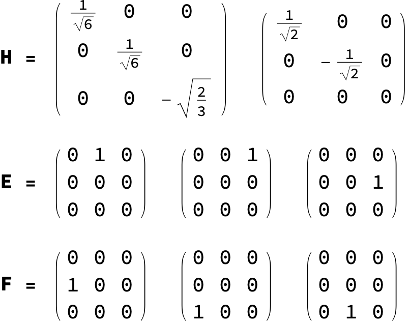

### Chevalley basis

The most convenient basis for building representations is the Chevalley basis:

```mathematica
ch = Chevalley[SU[3]];
Print["H = ", MatrixForm /@ ch["Cartan"], ", E = ", MatrixForm /@ ch["Raising"], ", F = ", MatrixForm /@ ch["Lowering"]];
```

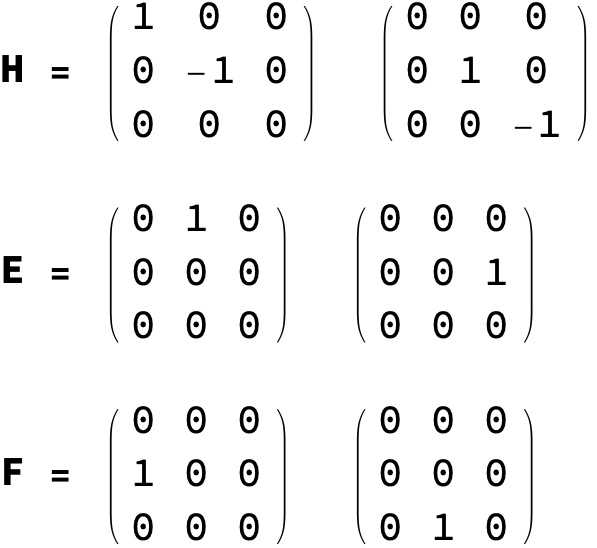

In this basis the generators split into two coupled SU(2) subalgebras, which we can picture as transitions in a three-level system:

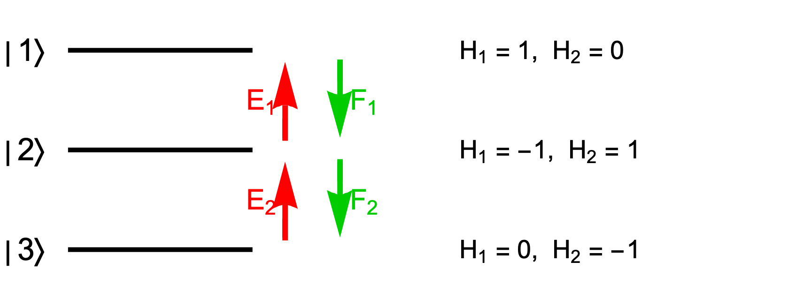

The three kinds of Chevalley generator act on the system as follows:

- $E_1, E_2$ raise the energy level, and $F_1, F_2$ lower it.
- $E_1, F_1, H_1$ generate the SU(2) acting between $|1\rangle$ and $|2\rangle$, and $E_2, F_2, H_2$ generate the SU(2) acting between $|2\rangle$ and $|3\rangle$.
- $H_1, H_2$ are the two "magnetic quantum numbers" of the system: each level is an eigenstate with eigenvalues set by $H_1$ and $H_2$.
- Reading those eigenvalues off, $E_1$ shifts the magnetic quantum numbers by $(2, -1)$ and $E_2$ shifts them by $(-1, 2)$; $F_1$ and $F_2$ shift them in the opposite direction.

This three-level system is the fundamental representation of SU(3). Larger representations are built from $N$ copies of it: for an $N$-body system the total generators are

$$
H = \sum_i H_i, \qquad E = \sum_i E_i, \qquad F = \sum_i F_i.
$$

The total magnetic quantum numbers label the states of the representation. This label is the *weight* of the state. States of different weight are orthogonal, but a single weight may be shared by several linearly independent states. Those states need not be orthogonal, so when a weight is degenerate we orthogonalize them, just as one does in quantum mechanics.

### Young tableaux and wave functions

To build an irreducible representation it is enough to start from any state in it and apply the generators until the space closes. The natural starting point is the highest-weight state, and a Young tableau hands it to us directly.

An SU(3) irrep corresponds to a Young diagram of at most two rows. A diagram with row lengths $[\mu_1, \mu_2]$ carries the irrep with Dynkin labels $(\mu_1 - \mu_2, \mu_2)$; equivalently, the $(l_1, l_2)$ irrep has a highest-weight tableau of shape $[l_1 + l_2, l_2]$, filled with $1$s along the first row and $2$s along the second. For the $(1, 1)$ irrep the shape is $[2, 1]$:

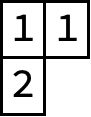

To get the wave function of a tensor tableau, apply its Young symmetrizer:

```mathematica
ct = Tableau[{{1, 2}, {3}}];
v = Psi[1, 1, 2];
TableauPermute[ct, v]
```

```mathematica
2 Psi[1, 1, 2] - Psi[1, 2, 1] - Psi[2, 1, 1]
```

We keep the tensor-tableau form because it is a compact notation for the many-body wave function and because it shows the permutation symmetry directly. Since the columns of a Young symmetrizer are antisymmetric, a repeated entry within a column makes the wave function vanish.

### The (1,1) representation of su(3)

Starting from the highest-weight state, we apply the lowering generators and follow the transitions they produce. A single line denotes the action of $F_1$ and a double line the action of $F_2$; we leave the size of each matrix element until later. The first level of transitions is

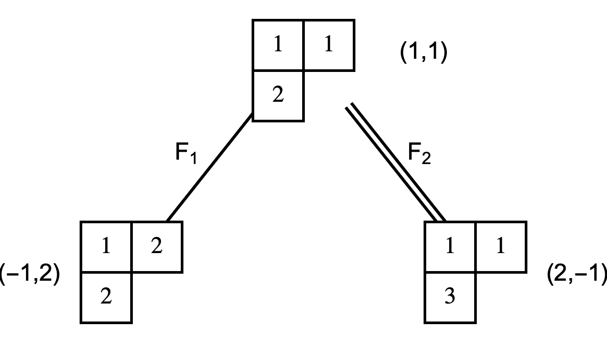

with the weight of each state shown beside its tableau. (A weight can be found either by summing the magnetic quantum numbers of its cells or by tracking how the lowering operators shift it.)

At the second level, take the state on the left:

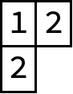

Acting with $F_1$ annihilates it, because a repeated entry then appears in a column. Acting with $F_2$ turns it into a superposition of two tableaux:

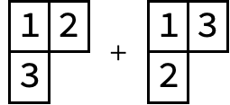

The state on the right is annihilated by $F_2$, since it contains no entry that $F_2$ can lower, and $F_1$ sends it to


The second tableau is not standard, but the symmetry of the Young symmetrizer (which exchanges the entry $1$ with $2$ and $3$) rewrites it:

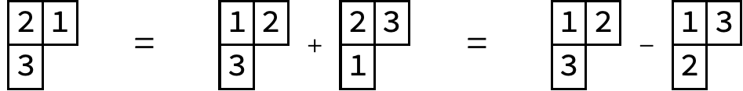

and in standard form the result is

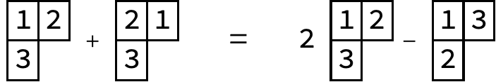

Both states reached at the third level have weight $(0, 0)$, so this weight is degenerate and we orthogonalize within it. As with Gram–Schmidt orthogonalization in quantum mechanics, the choice of basis is not unique; the usual convention keeps the state generated by the lower-index operator and orthogonalizes the others against it. Here we keep the state on the right. The package does this mechanically. First build the two tableaux:

```mathematica
a = 2 TensorTableau[{{1, 2}, {3}}] - TensorTableau[{{1, 3}, {2}}];
b = TensorTableau[{{1, 3}, {2}}] + TensorTableau[{{1, 2}, {3}}];
```

then orthogonalize:

```mathematica
{c, d} = TableauOrthogonalization[a, b];
```

and print the result:

```mathematica
TableauForm /@ {c, d}
```

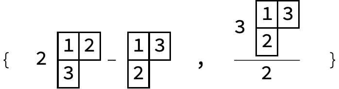

This completes the structure of the $(1, 1)$ representation: an eight-dimensional space whose nodes give an orthonormal basis, with the transitions between basis states laid out by the diagram.

#### Transition matrix elements

What remains is the size of each transition. As in quantum mechanics, the coefficients follow largely from the normalization of the states. Consider this transition:

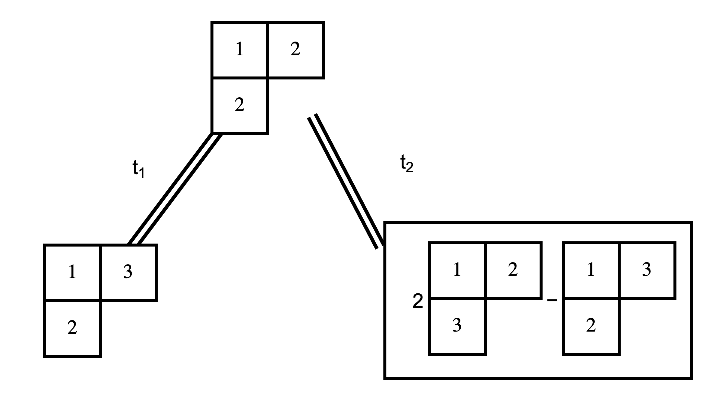

Start from the state


call it $|a\rangle$, and normalize it:

```mathematica
a = TensorTableau[{{1, 2}, {2}}];
na = TableauNormalization[a];
Print["|a> = ", TableauForm[na]];
```

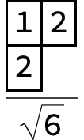

Acting with $F_2$ gives

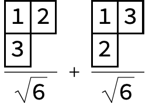

Call this $|b\rangle$. Together with the two basis states $|c\rangle$ and $|d\rangle$ of the $(0, 0)$ space, we normalize and take inner products to read off the transition matrix element:

```mathematica
b = TensorTableau[{{1, 2}, {3}}]/Sqrt[6] + TensorTableau[{{1, 3}, {2}}]/Sqrt[6];
c = TensorTableau[{{1, 3}, {2}}];
d = 2 TensorTableau[{{1, 2}, {3}}] - TensorTableau[{{1, 3}, {2}}];
nc = TableauNormalization[c];
nd = TableauNormalization[d];
Print["|c> = ", TableauForm[nc], ", |d> = ", TableauForm[nd], ", <d|b> = ", TableauDot[nd, b]];
```

The inner product `TableauDot[nd, b]` is the transition matrix element.

## Representations

Build an irreducible representation from its highest weight (Dynkin labels) and read off its data:

```mathematica
ir = Irrep[SU[3], {1, 1}];           (* the adjoint / octet *)
RepresentationDimension[ir]           (* 8 *)
CasimirEigenvalue[ir]                 (* 6 *)
WeightSystem[ir]                      (* <|{1,1}->1, ..., {0,0}->2, ...|> *)
m = RepresentationMatrices[ir];       (* <|"Cartan"->{H1,H2}, "Raising"->{E1,E2}, "Lowering"->{F1,F2}|> *)
```

`RepresentationMatrices` gives the Chevalley generators of the algebra (one `H`, `E`, `F` per simple root) as matrices in the irrep, in an orthonormal basis where `E_i = ConjugateTranspose[F_i]` and `H_i` is diagonal. The construction is the abstract highest-weight / Shapovalov method, so it works for **all** classical types and every irrep — including the orthogonal and symplectic spinor representations that do not live in tensor powers of the defining representation, e.g. the 4-dimensional spinor of `so(5)`:

```mathematica
RepresentationDimension[Irrep[SO[5], {0, 1}]]   (* 4 *)
RepresentationMatrices[Irrep[SO[5], {0, 1}]]
```

## Regenerating the figures

Every figure in this README is generated directly from the package by [`pics/MakeFigures.wls`](../pics/MakeFigures.wls), so the figures stay in step with the code. Rasterizing the typeset matrices and tableaux needs a Wolfram front end, so run the script with a full installation rather than a bare command-line kernel:

```sh
wolframscript -file pics/MakeFigures.wls
```

The script also prints a short report confirming that the $(1, 1)$ expressions it draws agree with the package.
